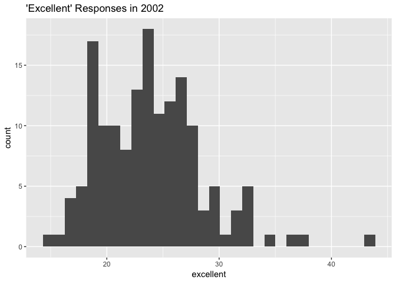
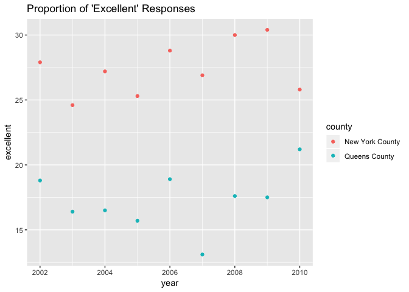

p8105\_hw2
================
Melanie Mayer
10/2/2018

Question 1
----------

Below I am reading in and cleaning my data:

``` r
transit_data = read_csv(file = "./data/NYC_Transit_Subway_Entrance_And_Exit_Data.csv") %>%
  janitor::clean_names() %>%
  select(line:ada, -c(exit_only, staffing, staff_hours)) %>%
  mutate(entry = ifelse(entry == "YES", TRUE, FALSE))
```

This dataset contains information on the NYC transit, specifically the line/routes per station, their specific longitudinal/latitudinal location, entrance capability and style, whether vending is available, and whether it is ADA compliant. So far I have inputted the raw data, cleaned the variable names so that they are standard and hense easier to call, and selected the variables of interest to me in the dataset. I also converted the "entry" variable into a logical vector. This makes it is easier to analyze due to the underlying numerical values of logical values.

The dimensions of this data frame are a length of 1868 and a width of 19.

This data is not yet tidy because there are many columns dedicated to the different routes per station. This should not be treated as 11 different variables but as one and each should represent a different observation. I will tidy the data in order to answer the remaining questions.

Below I tidy the data. I also create a seperate dataset containing information per station instead of per line to avoid duplicating code later on.

``` r
transit_data = transit_data %>%
  gather(key = route_number, value = route, route1:route11, na.rm = TRUE)

transit_data_stations = transit_data %>%
  distinct(transit_data_tidy, station_name, line, .keep_all = TRUE)
```

Now that the data is tidy summarizing is easier. The amount of distinct stations is 465 and the amount which are ADA compliant are 84.

The proportion of station entrances/exits without vending that allow entrance is 0.56.

Since the data was made tidy above, it is already reformated so that route number and route name are distinct variables.

``` r
#Distinct stations serving the A train
transit_data %>%
  filter(route == "A") %>%
  distinct(station_name, line) %>%
  nrow()
```

    ## [1] 60

``` r
#Of the stations that serve the A train, hproportion that are ADA compliant
transit_data %>%
  filter(route == "A") %>%
  distinct(station_name, line, .keep_all = TRUE) %>%
  filter(ada == TRUE) %>%
  nrow()  
```

    ## [1] 17

Question 2
----------

Below I read and clean the Mr. Trash Wheel excel sheets:

``` r
trash_wheel_data = read_excel("./data/HealthyHarborWaterWheelTotals2018-7-28.xlsx", 
                              sheet = 1, range = cell_cols("A:N")) %>%
  janitor::clean_names() %>%
  filter(!is.na(dumpster)) %>%
  mutate(sports_balls = as.integer(round(sports_balls, 0)))

precipitation_2016_data = read_excel("./data/HealthyHarborWaterWheelTotals2018-7-28.xlsx", 
                                     sheet = 5, range = cell_rows(2:14)) %>%
  janitor::clean_names() %>%
  filter(!is.na(total)) %>%
  mutate(year = 2016)


precipitation_2017_data = read_excel("./data/HealthyHarborWaterWheelTotals2018-7-28.xlsx", 
                                     sheet = 4, range = cell_rows(2:14)) %>%
  janitor::clean_names() %>%
  filter(!is.na(total)) %>%
  mutate(year = 2017)


precipitation_ttl_data = bind_rows(precipitation_2016_data, precipitation_2017_data) %>%
  mutate(month = month.name[month])
```

The trash wheel data has 285 observations. This dataset looks into the amount and types of trash collected by Mr. Trash Wheel since 2014 per each dumpster, as well as how much energy was generated using this trash. Interesting variables are the volume and weight of the trash, showing the large amounts of trash which were collected. The average weight of trash collected per dumpsters is 3.28. The data set also tells us that 1969.05 plastic bottles, 27.98 glass bottles, 1418.87 grocery bags, 1920.56 chip bags, and 12.66 sports balls were collected on average by each dumpster.

The combined precipitation data for 2016 and 2017 has 24 observations, a result of having data for all 12 months for two years. This simply tells us the total amount of precipitation in inches per month in each year. The avergage precipitation in 2016 per month was 3.33. For 2017 it was 2.74.

The total precipitation in 2017 was 32.93. The median number of sports balls in a dumpster in 2016 were 26.

Question 3
----------

Below I access and clean the data for question 3:

``` r
brfss_data = brfss_smart2010 %>%
  janitor::clean_names() %>%
  filter(topic == "Overall Health") %>%
  separate(locationdesc, into = c("remove", "county"), sep = " - ") %>%
  select(-c(remove, class:question, sample_size, confidence_limit_low:geo_location)) %>%
  rename(state = locationabbr) %>%
  spread(key = response, value = data_value) %>%
  janitor::clean_names() %>%
  mutate(excellent_or_very_good = excellent + very_good)
```

There are 351 distinct counties in the data set and 51 distinct states, meaning all 50 states and Washington DC. The most observed state is NJ.

In 2002, the median of the “Excellent” response value is 23.6.

Below I make graphs to help understand the data.

``` r
brfss_data %>%
  filter(year == 2002) %>%
  ggplot(aes(x = excellent)) +
  geom_histogram() + 
  labs(title = "'Excellent' Responses in 2002")
```

    ## Warning: Removed 2 rows containing non-finite values (stat_bin).



``` r
brfss_data %>%
  filter(county %in% c("New York County", "Queens County")) %>%
  ggplot(aes(x = year, y = excellent, color = county)) +
  geom_point() + 
  labs(title = "Proportion of 'Excellent' Responses")
```


